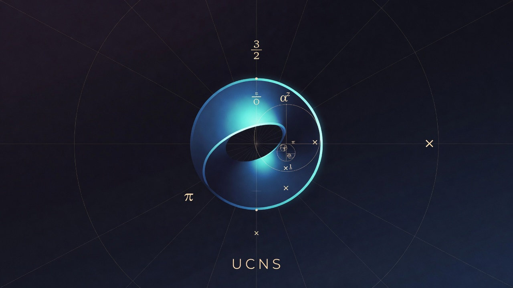

# ucns — Unit Circle Number System: Recursive Factorization Theory

<p align="center"></p>

> **Experimental sequence-theoretic factorization on the unit circle, with a witness-matrix recursive quotient solver.**

This repository contains the UCNS (Unit Circle Number System) sequence theory and its implementation. The focus is **recursive factorization**: given a UCNS product object *P*, recover factors *A* and *B* such that *A ⊠ B = P*.

`ucns` is currently a research-stage Python package. It is suitable for experimentation, integration tests, and collaborator review. Public APIs may still change while the mathematics and implementation are being formalized.

> **v1.0 scope.** UCNS v1.0 is a scoped, reproducible research release for
> catalogue-sufficient recursive factorization (Theorem N), not a claim of
> total general recursive primality. Carrier widening and general
> recursive completeness are explicitly out of v1.0 scope. See
> `docs/ucns-spec-status-addendum-2026-05-16.md` for the status vocabulary,
> `docs/claims-ledger.md` for current release-status claims, and
> `ucns-spec.md` for the consolidated specification. The status snapshot at
> the top of `ucns-spec.md` is dated 2026-05-17 and is historical wherever it
> differs from this README and the claims ledger.
>
> **Public API.** `ucns` is the v1.0 public Python API.
> `ucns.a0_safe` is the A0-safe inspection facade. The recursive
> engine now lives directly under `ucns`; `ucns_recursive` is retained only as a
> compatibility import path and is **deprecated** for direct user imports.

---

## Installation

From PyPI, once released:

```bash
pip install ucns
```

From GitHub:

```bash
pip install git+https://github.com/The-Interdependency/ucns.git
```

For development:

```bash
git clone https://github.com/The-Interdependency/ucns.git
cd ucns
python -m pip install -e .[dev]
python -m pytest ucns_recursive/tests tests -v
```

---

## Collaboration wanted

We are currently looking for mathematics collaborators to help formalize UCNS.

Start here:

- Collaboration issue: https://github.com/The-Interdependency/ucns/issues/7
- Starter task: define one UCNS term in standard mathematical language, with notation, example, non-example, and relationship to existing concepts.

The ask is bounded: help separate definitions, implemented algorithms, empirical results, proof sketches, conjectures, limitations, and counterexamples. The current formal frontier is partially verified in Lean, with remaining proof leaves under active discharge. Cancellativity is not claimed globally; the valid target is the restricted `Complete` plus common-depth domain unless the live formalization proves a stronger restricted theorem.

GPT generated; context, prompt Erin Spencer.

---

## Status: Current Theorem Frontier

Status vocabulary (from `docs/ucns-spec-status-addendum-2026-05-16.md`):
`DEFENDED`, `IMPLEMENTED`, `TEST-BACKED`, `ORACLE-COMPLETE`, `FRONTIER`,
`EXPERIMENTAL`.

| Layer | Status |
|---|---|
| Flat kernel algebra | `DEFENDED` |
| Depth-1 restricted completeness | `DEFENDED` |
| Depth-2 oracle (Lemma 7) | `DEFENDED` + `ORACLE-COMPLETE` |
| Full frozen depth-2 domain | `IMPLEMENTED` + `TEST-BACKED` (not yet `DEFENDED` at spec level) |
| Depth-3 asymmetric (Theorem 9) | `TEST-BACKED` (6/6 empirical) |
| **Catalogue-sufficient completeness — all depths (Theorem N)** | **`FRONTIER` — partially verified in Lean; remaining proof leaves under active discharge** |
| Tractable sub-catalogues | `FRONTIER` |
| Carrier widening | `FRONTIER` / out of v1.0 scope |
| General recursive primality outside defended-complete domains | out of v1.0 scope |

This section together with `docs/claims-ledger.md` is authoritative for current
release-status claims. The status snapshot at the top of `ucns-spec.md` is dated
2026-05-17 and is historical wherever it differs.

`factor_search_v08` (the **witness-matrix recursive quotient solver**) is the v1.0 factorization engine. It now lives directly in the `ucns` package; `ucns_recursive` is a deprecated compatibility shim for legacy imports.

See `ucns-theorem-n.md` for the unified catalogue-sufficient theorem statement and its current formal frontier. The key implementation insight is depth-agnostic: every `factor_search_v08` step operates on `==` and plain catalogue scans, while the catalogue remains the depth-sensitive input.

**Prime quartet discontinuity.** Cross-repo interoperability (`ucns`, `edcmbone`, `a0`, `interdependent-lib`) is not theorem continuity by default. See `docs/prime-quartet-discontinuity.md` and `docs/edcm-edcmbone-bridge-checklist.md`.

**A0 rule.** `SEQ-PRIME` is only absolute inside a defended-complete
domain. A0-facing consumers should consult `domain_status_metadata` and
treat `SEQ-PRIME` outside `VERIFIED_DOMAIN_LABELS` as non-absolute.

---

## Repository Layout

```
ucns/                    # v1.0 public Python API and engine implementation
  __init__.py            # from ucns import UCNSObject, multiply, factor_search_v08, ...
  a0_safe.py             # A0-safe inspection facade: identity, describe, canonical, factor
  canonical.py           # UCNSObject, multiply, is_unit
  domains.py             # Frozen D' domain + payload catalogue
  domain_status.py       # Typed status vocabulary (DEFENDED, IMPLEMENTED, ...)
  host_recovery.py       # Recover host angle/face structure from P
  recursive_quotient.py  # find_left_factor, find_right_factor
  payload_system.py      # Coupled payload equation solver
  witness_matrix.py      # Witness, WitnessMatrix (global consistency)
  factor_search_v08.py   # Top-level factorization engine
  factorization_result.py  # A0-facing scoped factorization envelope
  object_record.py       # A0-facing object inspection record
  serialization.py       # Canonical JSON + stable hash
  core.py, embedding.py, epicycle.py, mobius.py, similarity.py
                         # v0.6.5-lineage modules (stable reference)

ucns_cache/              # experimental UCNS-native cache prototype
  keys.py                # canonical/payload/braider key generation + factor reuse
  primitive_streams.py   # angle / rotation / chirality stream derivation
  braider.py             # deterministic event braid + lattice hash
  store.py               # in-memory exact/structural/factor lookup store
  policy.py, instrumentation.py

ucns_recursive/          # DEPRECATED compatibility wrappers around ucns modules
  tests/                 # Legacy compatibility and recursive-engine test suite

tests/                   # v1.0 API-package tests plus cache prototype tests

ucns-spec.md             # Consolidated spec; status snapshot dated 2026-05-17
ucns-theorem-n.md        # Theorem N: catalogue-sufficient frontier statement
ucns-lemma8-depth3.md    # Depth-3 factor search (SUPERSEDED — see theorem-n)
ucns-spec-frontier-v090.md  # v0.9.0 frontier (partially superseded)
docs/
  claims-ledger.md                          # Current release-status claims
  ucns-spec-status-addendum-2026-05-16.md  # Status vocabulary + A0 rule
  ucns-native-caching.md                   # Cache prototype boundary/limits
  pure-ucns-number-system.md
  coherence-primes-scarcity.md
code/                    # Exploratory artifacts (v0.8.0–v0.9.0)
code/sweeps/             # Empirical verification scripts
scripts/bench_ucns_cache.py  # Lightweight cache benchmark harness; no speedup claims
examples/visualization/  # Human-facing visualization boundary tests
  seed53.html            # 53-residue skip-star + heptagram + unwrap demo
  README.md              # claim linkage, non-proof boundary, open constraints
```

### What belongs in this repo (and how to place visual demos)

This repository is primarily for UCNS mathematics, Python implementation,
tests, and reproducible research artifacts.

Interactive front-end demos (including single-file HTML/JS/SVG sketches)
**can** belong here when they function as research support artifacts: they
must clarify a theorem/mechanism, document a failure boundary, or support a
reproducibility workflow.

If you add one, place it under `examples/visualization/` and include a short
README that states:

- the exact UCNS claim/theorem/domain status it illustrates;
- what the demo does **not** prove (honest boundary of inference);
- how it acts as a boundary object for unresolved constraints (what remains
  open, and what transition it marks between delivered artifact and ongoing
  research).

If the artifact is primarily outreach/showcase and not directly tied to UCNS
verification or documentation, publish it as a separate GitHub Pages micro-app
and link it from docs.

> `ucns_recursive` is **deprecated for direct user imports** as of v1.0
> canon reconciliation. New code should import from `ucns` and
> `ucns.a0_safe`. `ucns_recursive` remains a supported compatibility
> import path (no runtime warning yet), but the engine implementation now
> lives directly under `ucns`.

---

## Core Algebra

Every UCNS object is a sequence of (angle, payload) pairs with a face-flip sequence:

```python
from ucns import UCNSObject, multiply, is_unit
from fractions import Fraction

UNIT = None

# S2: the canonical depth-0 sequence object
S2 = UCNSObject(2, 2, [(Fraction(0), UNIT), (Fraction(1), UNIT)], [0, 0])

# Depth-1 object: A carries S2 as payload in its first cell
A = UCNSObject(2, 2, [(Fraction(0), S2), (Fraction(1), UNIT)], [0, 0])
B = UCNSObject(2, 2, [(Fraction(0), S2), (Fraction(1), UNIT)], [0, 0])

# Product
P = multiply(A, B)
```

---

## Factorization: `factor_search_v08`

```python
from ucns import factor_search_v08

result = factor_search_v08(P)
# Returns (A_recovered, B_recovered)  or  "SEQ-PRIME"
```

Returns **a** valid factorisation — the first one found under the loop ordering (balanced p ≥ 2 splits first, p = 1 last). Factorisation is not generally unique; other valid pairs may exist. Use `store.factor_decompose` with an explicit catalogue to enumerate all catalogue-bounded factorisations.

The solver implements the full witness-matrix pipeline:

1. **Host recovery** — extract candidate A/B angle sequences from P
2. **Payload system construction** — build the p×q coupled equations  
   `multiply(S_A[k], S_B[j]) == P_payloads[k][j]`
3. **Witness-matrix consistency** — verify one globally consistent payload assignment explains every cell
4. **Face recovery** — enumerate valid face-bit assignments
5. **Exact recomposition** — final truth test: `multiply(A_cand, B_cand) == P`

For depth-3+ targets, extend the catalogue with the deep payloads of the expected factors
(see `ucns-theorem-n.md §4.2–4.3`):

```python
# Theorem 9 example: depth-3 A × depth-2 B
from ucns import depth_of

def catalogue_from(*objs):
    """Minimal catalogue: recursive payload closure of given objects."""
    cat = [None]
    def collect(o):
        if o is None: return
        for _, p in o.A_plus:
            if p is not None and p not in cat:
                cat.append(p); collect(p)
    for o in objs: collect(o)
    return cat

result = factor_search_v08(P, catalogue_from(A, B))
```

---

## Running the Tests

```bash
python -m pip install -e .[dev]
python -m pytest ucns_recursive/tests tests -v
```

---

## Build and release validation

```bash
python -m pip install -e .[dev]
python -m build
python -m twine check dist/*
python -m pytest ucns_recursive/tests tests -v
```

Clean wheel install smoke test:

```bash
python -m venv /tmp/ucns-wheel-test
. /tmp/ucns-wheel-test/bin/activate
pip install dist/*.whl
python - <<'PY'
from ucns import UCNSObject, multiply, factor_search_v08
print('ucns import ok')
PY
```

---

## Root Cause Fixed (E10.9)

The v0.8.0 failure analysis identified three root causes now corrected in `factor_search_v08`:

1. **No false atomicity** — depth-1 payloads such as S2 are descended into recursively, not treated as atomic
2. **Global witness consistency** — a single assignment of all payload factors must explain every cell simultaneously
3. **Staged reconstruction** — host recovery → payload system construction → witness verification

---

## Completeness Frontier

UCNS has a `DEFENDED` flat kernel, a `DEFENDED` depth-1 restricted
completeness theorem, and a `DEFENDED` + `ORACLE-COMPLETE` depth-2
oracle theorem (Lemma 7). Theorem N is the current catalogue-sufficient
frontier statement: if the catalogue contains every recursive payload of
true non-multiplicative-unit factors, `factor_search_v08` is expected to
find a recomposing factorization. Its Lean statements still contain
`sorry` leaves and require external formal review before any stronger
public theorem status.

The full frozen depth-2 domain is `IMPLEMENTED` + `TEST-BACKED` in
`factor_search_v08` but not yet `DEFENDED` at the spec level. Theorem 9
(asymmetric depth-3) is `TEST-BACKED` empirically; see
`code/sweeps/t9_minimal_cat.py`. Carrier widening remains `FRONTIER`
and out of v1.0 scope.

---

**Accreditation:** GPT generated from context provided by Grok, Claude as prompted by Erin Spencer.
