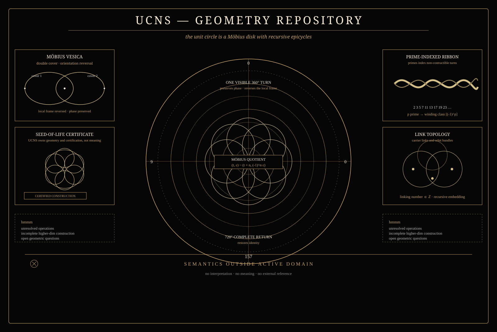

# UCNS

<p align="center">
  
</p>

UCNS is a geometry repository.

Its active scope is limited to constructions that directly represent or test geometry:

- the exact 157-position Public Gonol carrier;
- the directed lifted carrier and its 360° visible / 720° complete return;
- exact framed Möbius motion;
- Möbius vesica and Seed-of-Life constructions and certificates;
- prime-indexed ribbon, link, interval, Milnor, Alexander, and related topological geometry;
- numerical machinery used to certify those constructions.

Everything semantic is outside this repository's active domain: lexical corpora, definitions, morphology, NLP parsing, function-name semantics, EDCM measurement profiles, PTCNA state, evaluator laboratories, and cross-stack adapters.

The poster above is a display certificate of those constructions. It is not an interpretation layer.

## Public Gonol

The Public Gonol is the exact ordered 157-position carrier in `src/ucns/public_gonol.py`. Every glyph is a Public Gonol function position. UCNS does not divide glyphs into letters, punctuation, digits, or symbols for construction.

A function's geometric operation is not inferred from Unicode names or dictionary definitions. Where an operation is not geometrically established, it remains `hmmm`.

## Möbius root loop

`src/ucns/direct_mobius.py` implements the exact framed quotient

```text
(t, ε) ~ (t + n, (-1)^n ε)
```

One visible turn preserves phase and reverses the local frame. Two visible turns restore the complete state.

## Geometry modules

The active package also retains the Möbius vesica/seed family and the `prime_*` topological geometry family. Generated geometry certificates remain evidence; semantic receipts do not.

## Usage

```python
from fractions import Fraction
from ucns import public_gonol_function, native_mobius_state

w = public_gonol_function("w")
s0 = native_mobius_state(Fraction(0))
s360 = s0.advance(1)
s720 = s0.advance(2)

assert s360.visible_key == s0.visible_key
assert s360.complete_key != s0.complete_key
assert s720 == s0
```

## Build

```bash
python -m pip install -e ".[test,build]"
python -m pytest -q
python tools/verify_skill_lib_contracts.py .
python -m build
python -m twine check dist/*
```

`hmmm`: the complete higher-dimensional UCNS construction and the exact geometric operation of every Public Gonol function position remain unresolved. Unresolved geometry stays unresolved; semantic machinery is not used to fill it.
