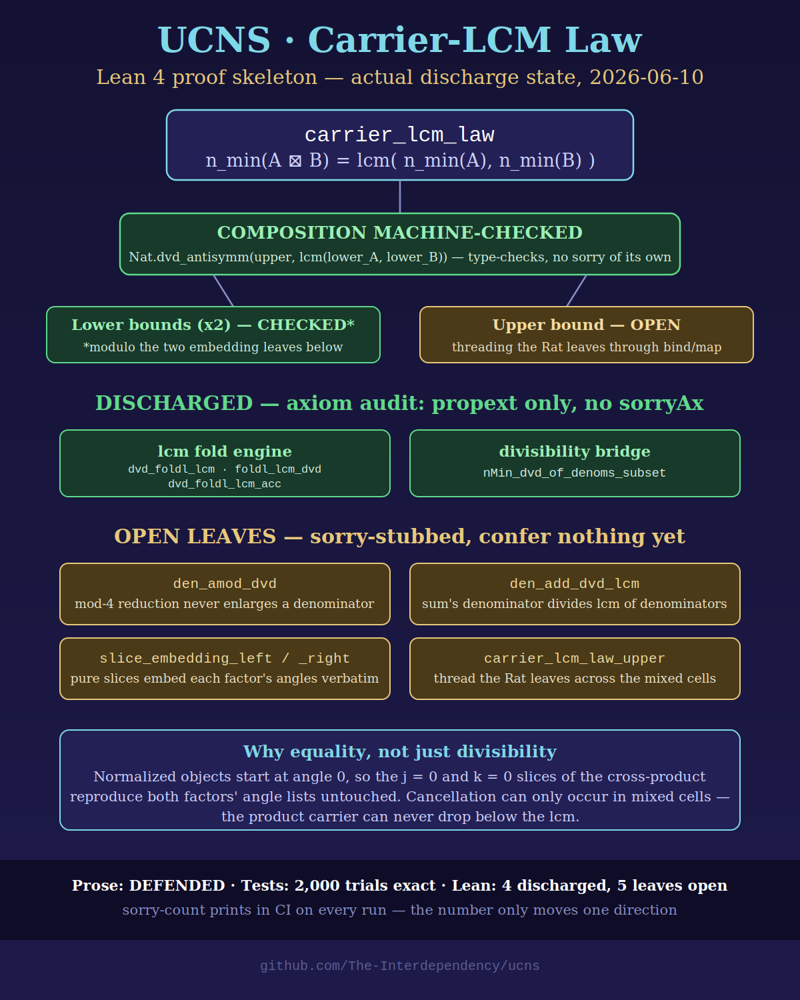
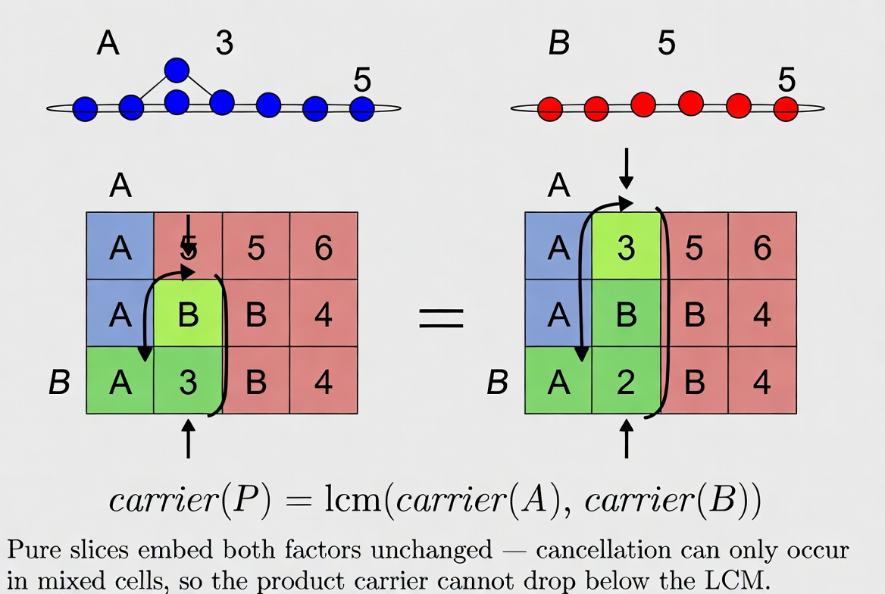

# Carrier-LCM Law and Carrier-Support Pruning

**Status:** DEFENDED (prose proof below) + TEST-BACKED
(`ucns_recursive/tests/test_catalogue_pruning.py`, property test at 2000
random trials, depths 0–2, plus search-equivalence tests on the frozen
depth-2 oracle catalogue).
**Scope:** the canonical recursive engine in this repository
(`ucns.canonical`): normalized `UCNSObject`s under `multiply`.
**Relation to prior work:** `docs/ucns_operational_widening.md` stated the
Per-Sublattice Finiteness Law and witnessed it on the edcmbone `ucns_v04`
substrate. This document proves the underlying carrier identity *exactly*
(equality, not merely divisibility) on the canonical substrate, and derives
the catalogue-pruning rule that `factor_search_v08` callers may apply.
**Accreditation:** Claude generated from repository context as prompted by
Erin Spencer; proof verified against the implementation in
`ucns/canonical.py` at the commit introducing this file.

---

*Figure: claim-bearing (deterministic; see `media/README.md`). Reflects
the discharge state at the date shown; stale if the sorry inventory in
`formal/Ucns/CarrierLcm.lean` has since changed.*

## 1. Definitions

For a normalized `UCNSObject` `X`, write:

- `angles(X)` for the multiset of host angles in `X.A_plus` (values in
  `[0, 4)`, as `Fraction`s),
- `n_min(X)` for the carrier computed by `_compute_n_min`: with
  `c(a) = (a mod 2) / 2`, the carrier is
  `lcm { denominator(c(a)) : a in angles(X), c(a) != 0 }` (empty lcm = 1),
- `supp(n)` for the set of prime divisors of the positive integer `n`.

Two implementation facts used below, both enforced by `normalize()`:

- **(N1)** A normalized object's first host angle is `0`
  (`new_theta = (theta - theta0) mod 4` puts `0` in position 0).
- **(N2)** `multiply(A, B)` forms product angles
  `(alpha_k + (beta_j - beta_0)) mod 4` over all pairs `(k, j)`; for
  normalized `B`, `beta_0 = 0`, so product angles are
  `(alpha_k + beta_j) mod 4`.

## 2. The Carrier-LCM Law

> **Law.** For normalized UCNS objects `A`, `B` with `P = multiply(A, B)`:
>
> `n_min(P) = lcm(n_min(A), n_min(B))`.

**Proof.**

*Upper bound — `n_min(P) | lcm(n_min(A), n_min(B))`.* Every product angle
is `(alpha + beta) mod 4` for some `alpha in angles(A)`,
`beta in angles(B)` (N2). Write `L = lcm(n_min(A), n_min(B))`. Each
`c(alpha)` is a fraction whose denominator divides `n_min(A)`, hence
divides `L`; likewise `c(beta)`. The map `a -> c(a) = (a mod 2)/2` is
additive up to integers: `c(alpha + beta) ≡ c(alpha) + c(beta) (mod 1)`,
and reduction mod 1 cannot enlarge a denominator. So every
`denominator(c(product angle))` divides `L`, and their lcm — which is
`n_min(P)` — divides `L`. (The final `normalize()` of `P` shifts all
angles by the same constant `theta_0`; by (N1) and (N2) the product's
first angle is `alpha_0 + beta_0 = 0`, so the shift is the identity and
changes nothing. Even for a nonzero shift the argument would still give
divisibility by `L`, since the shift constant is itself a product angle.)

*Lower bound — `lcm(n_min(A), n_min(B)) | n_min(P)`.* This is the step
that rules out cancellation, and it is where normalization earns its keep.
By (N1), `alpha_0 = 0` and `beta_0 = 0`. Taking the `j = 0` slice of the
product, the angles `(alpha_k + 0) mod 4 = alpha_k` appear in `angles(P)`
for every `k`: **the entire angle multiset of `A` embeds verbatim in the
product**. Taking the `k = 0` slice, every `beta_j` likewise embeds. So
`angles(P) ⊇ angles(A) ∪ angles(B)` (as sets of values), hence the
denominator set defining `n_min(P)` contains the denominator sets defining
`n_min(A)` and `n_min(B)`, hence `n_min(A) | n_min(P)` and
`n_min(B) | n_min(P)`, hence `lcm(n_min(A), n_min(B)) | n_min(P)`.

Both divisibilities give equality. ∎

**Remarks.**

1. Cancellation in cross-sums (`c(alpha) + c(beta)` collapsing to a
   smaller denominator) does occur — but it can only affect the *mixed*
   slices `k, j ≥ 1`; the pure slices `j = 0` and `k = 0` preserve each
   factor's angles untouched. This is why the Law is an equality here
   rather than the one-sided divisibility one might fear.
2. The Law is a host-level statement: payload nesting does not enter
   `_compute_n_min`, so the Law holds at every depth uniformly.
3. The Per-Sublattice Finiteness corollary follows immediately: carriers
   drawn from the multiplicative lattice `⟨S⟩` of a prime set `S` are
   closed under `multiply`, since lcm preserves prime support.

*Schematic: decorative class (AI-generated; see `media/README.md`). The
embedded caption states the proof's key step correctly; the grid cell
values are illustrative texture, not data.*

## 3. Corollary: Carrier-Support Pruning

> **Corollary (pruning rule).** If `multiply(A, B) = P` with `A`, `B`
> normalized, then `supp(n_min(A)) ⊆ supp(n_min(P))` and
> `supp(n_min(B)) ⊆ supp(n_min(P))`.
>
> Consequently, any factor-candidate or payload-candidate `C` with
> `supp(n_min(C)) ⊄ supp(n_min(P))` can be removed from the search
> catalogue without losing any valid factorization of `P`.

**Proof.** By the Law, `n_min(A) | n_min(P)`, and divisibility implies
support containment. The catalogue statement follows because a candidate
participating in any valid factorization is (or is a payload of) a factor,
and payload carriers are bounded by their host's domain constraints; in
all cases a candidate whose top-level carrier already escapes
`supp(n_min(P))` cannot appear as a top-level factor. ∎

**Implementation.** `ucns.catalogue_pruning.prune_catalogue(P,
catalogue)` applies exactly this filter (unit payload always survives —
carrier 1, empty support). It is **opt-in**: callers pass the pruned
catalogue to `factor_search_v08`; the engine itself is untouched, so
soundness of the engine is unchanged and rollback is removal of the
module.

**Status discipline.** This pruning rule upgrades one row of the claims
ledger: "Performance scaling for large catalogues" gains a DEFENDED
sound-pruning component. It does **not** close the tractability frontier
(pruning helps only when the catalogue spans more prime support than `P`
does), and it makes no claim about cross-prime *analytic* widening, which
remains FRONTIER.

## hmmm

- The Lean-checkable statement of the Law (Tier-2 target) — the embedding
  argument is structurally simple and is a natural early discharge after
  cancellativity.
- Whether pruning should become a default inside `factor_search_v08`
  rather than an opt-in pre-filter — a decision for the user, not this
  document.

## 4. Corollary 2: Payload-catalogue pruning (the sound `factor_search` rule)

The host-carrier rule of §3 applies to LEFT-FACTOR catalogues and is
**unsound for payload catalogues**: `n_min` is host-level, so a factor's
payload may carry primes invisible in `n_min(P)`.

The sound payload-level rule:

> **Corollary 2.** Let `P = multiply(A, B)`. Every payload `S` of `A`
> (or `B`) satisfies `supp(n_min(S)) ⊆ U(P)` where
> `U(P) = ⋃ { supp(n_min(p)) : p a non-unit cell payload of P }`.

**Proof.** Fix a payload `S = S_k_A` of `A`. In `multiply`, the cell
`(k, j)` of `P` receives payload `multiply(S_k_A, S_j_B)` if `S_j_B` is
non-unit, or `S_k_A` itself if `S_j_B` is the unit. In the pass-through
case, `supp(n_min(S))` appears verbatim in `U(P)`. In the product case,
the Law (§2) applied one level down gives
`n_min(multiply(S_k_A, S_j_B)) = lcm(n_min(S_k_A), n_min(S_j_B))`, so
`n_min(S) | n_min(that cell payload of P)` and support containment
follows. Symmetrically for payloads of `B`. ∎

**Consequence.** A payload candidate whose carrier support escapes
`U(P)` can never serve as a factor payload; removing it preserves
completeness. Implemented as
`catalogue_pruning.prune_payload_catalogue`, wired **default-on** into
`factor_search_v08` with a `prune=False` escape hatch. The full test
suite (including all search-equivalence subtests) runs through the
pruned path.

**Edge discipline.** If all of P's payloads are unit, `U(P) = ∅` and
only carrier-1 candidates (and the unit) survive — sound, since an
all-unit-payload product forces all factor payloads to be unit
(`multiply` produces a non-unit payload whenever either operand payload
is non-unit).
