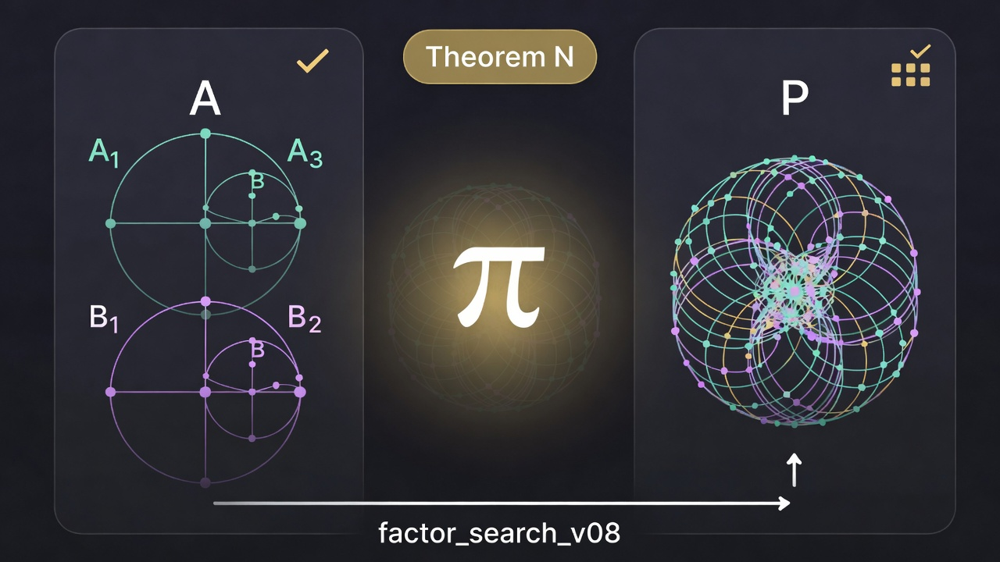

# UCNS - Theorem N: Catalogue-Sufficient Factorization

<p align="center"></p>

*Illustration: decorative class (AI-generated; see `docs/media/README.md`).*

**Status:** FRONTIER / implementation-backed proof sketch with repaired boundary hypotheses. This note supersedes Lemma 7, Theorem 8c, and the prior forall-n induction plan as the current catalogue-sufficient theorem statement, but it is not a Lean proof and does not confer DEFENDED status. The Lean stubs in this repository remain non-proving scaffold until all `sorry` placeholders and opaque search-procedure predicates are discharged and externally reviewed.

**Authors:** Theorem statement and unification - Claude.ai mobile session, Erin Spencer (May 2026). Empirical pre-work (6/6 Theorem 9 verification) - same session. Prior depth-indexed proofs (Lemma 7, Theorems 8a/8b/8c, forall-n draft) - this Code session. Boundary repair - June 2026 repo audit. Status reconciliation - July 2026 release-prep audit.

**Key finding:** `factor_search_v08` is depth-agnostic. One catalogue-sufficient statement covers all depths as a proof target; the depth-indexed hierarchy was presentational scaffolding, not structural content.

**Boundary repair:** The proof target requires the search loop to include the right-singleton split `p = n, q = 1`, not only interior `2 <= p < n` plus `p = 1`. The implementation now enumerates `p = 2..n` and then appends `p = 1`. The statement also speaks in terms of `is_multiplicative_unit`, matching the implementation; this is broader than merely excluding the identity unit.

---

## 1. Setup

### 1.1 Objects and multiplication

`UCNSObject(n_dec, n_min, A_plus, F_plus)` where `A_plus` is a sequence of `(angle, payload)` pairs, payloads are `UCNSObject | None`, and `None` is the identity element.

`multiply(A, B)` builds a `|A| x |B|`-cell product; cell `(k,j)` has angle `alpha_k + beta_j - beta_0` and payload `multiply(A.payload[k], B.payload[j])`. This is fully recursive and has no depth conditionals.

Key depth fact:

> `multiply(depth-k, depth-k)` produces depth-k.

Depth lifts only when one factor already carries payloads deeper than the other. This means `D'_oracle x D'_oracle`, where both factors have depth at most 2, produces depth-at-most-2 output.

### 1.2 Catalogue

A catalogue `C` is a list of `UCNSObject | None` objects. `factor_search_v08` uses `C` as the candidate set for reconstructed factor payloads, not as a set of factor pairs.

### 1.3 Algorithm

`factor_search_v08(P, C)` runs five depth-agnostic steps for each factorisation `n = p x q` of `n = |P.A_plus|`:

1. Host recovery: structural angle extraction.
2. Payload system construction and solve: catalogue scan via the intended quotient/cancellativity boundary.
3. Witness-matrix global consistency check.
4. Face recovery.
5. Exact recomposition: `multiply(A_cand, B_cand) == P`.

Loop ordering is now explicit: `p = 2..n` first, then `p = 1` last. This includes the right-singleton edge `p = n, q = 1` while preserving the original p=1 fallback rationale.

---

## 2. Theorem N

**Theorem N (catalogue-sufficient factorization; current frontier statement).** Let `A`, `B` be UCNS objects with `|A.A_plus|, |B.A_plus| >= 1`, and let `C` be a catalogue containing every payload appearing recursively in `A` or `B`, including `None`. Assume `A` and `B` are not multiplicative units under `is_multiplicative_unit`. Define `P = multiply(A, B)`. The target claim is that `factor_search_v08(P, C)` returns `(A', B')` with `multiply(A', B') = P`.

**No depth parameter. No oracle-class predicate.** The only catalogue hypothesis is: the catalogue contains the necessary payloads. The only non-triviality hypothesis is: the true factors are not in the multiplicative unit group that the implementation filters.

This is a proof target and implementation-backed proof sketch, not yet a machine-checked theorem.

---

## 3. Proof sketch

Let `p = |A.A_plus|`, `q = |B.A_plus|`, and `n = p*q`.

**Step 1 (Host recovery).** The implementation loop reaches `p`:

- if `p >= 2`, then `p` is in `range(2, n + 1)`, including the boundary case `p = n, q = 1`;
- if `p = 1`, then `p` is the explicit final fallback when `n >= 2`.

For `n = 1`, there is no non-trivial split between two non-multiplicative-unit length-positive factors in this search domain. `recover_host_angles(P, p, q)` returns the angle sequences of `A` and `B` exactly. This is structural and depth-free.

**Step 2 (Payload system).** For each `(k, j)`, `P.A_plus[k*q+j][1] = multiply(A.payload[k], B.payload[j])`. `solve_payload_system` iterates `S0_A` over `C`; when it reaches `S0_A = A.payload[0]`, which is in `C` by hypothesis:

- Row 0: `find_right_factor_or_sentinel(P.payload[j], A.payload[0], C)` scans `C` for `R` with `multiply(A.payload[0], R) = P.payload[j]`. The proof sketch relies on the cancellativity/quotient boundary to recover `R = B.payload[j]`; this remains part of the formal frontier until the Lean obligations are discharged.
- Column `k > 0`: symmetric recovery gives `A.payload[k]` in `C` under the same frontier obligation.
- Global consistency follows from construction of `P`.

**Step 3 (Witness matrix).** `globally_consistent()` uses equality on canonical objects. This is depth-agnostic.

**Step 4 (Face recovery).** `recover_face_structures(P, p, q)` is structural and returns the correct `A.faces` and `B.faces` among its options.

**Step 5 (Recomposition and non-triviality).** The candidate pair reconstructs a pair equivalent to `A`, `B`; exact recomposition verifies `multiply(A_cand, B_cand) = P`. The implementation rejects candidates for which either factor satisfies `is_multiplicative_unit`. Since the target hypothesis excludes such factors, the valid pair should not be filtered out.

---

## 4. Instances

### 4.1 Lemma 7: depth-2 oracle completeness

`A, B in D'_oracle` with depth at most 2. Every payload of `A` and `B` is a depth-1 oracle atom, all of which are in `C = generate_payload_catalogue()`. Theorem N applies as a frontier unifying statement when the factors are not multiplicative units; the historical Lemma 7 status remains `DEFENDED + ORACLE-COMPLETE` under its own narrower oracle assumptions.

### 4.2 Theorem 9: asymmetric depth-3

`A` is depth-3, so its payloads are depth-2 objects; `B` is depth-at-most-2. `C` must contain every payload of `A`, including depth-2 payloads, and every payload of `B`.

Empirical verification (`t9_minimal_cat.py`, May 2026): six asymmetric depth-3 cases, each with a minimal catalogue built from recursive payloads of the true factors, succeeded in milliseconds. This is `TEST-BACKED`, not proof-defended.

### 4.3 General depth-k

For any `P = multiply(A, B)` with `A`, `B` of depth at most `k`, build `C` as the recursive payload closure of `A` and `B`. This contains only objects of depth at most `k-1`, by the depth-of formula for `multiply`. Theorem N gives the intended catalogue-sufficient completeness target for the catalogue scan with `C`; no depth-conditional algorithm changes are expected.

---

## 5. Expressibility vs completeness

The depth-indexed oracle hierarchy addresses expressibility: for which `P` does there exist a factorization `P = multiply(A, B)` with payloads in a fixed depth-bounded catalogue?

Theorem N addresses algorithmic completeness as a frontier target: given that such a factorization exists, does `factor_search_v08` find it if the catalogue contains the necessary payloads and the true factors are not multiplicative units?

Separated:

> Expressibility (oracle-class hierarchy) + Theorem N (frontier catalogue-sufficient completeness target)
> would imply: if `P` is in the depth-k oracle class and `C` is the depth-(k-1) oracle catalogue, then `factor_search_v08(P, C)` returns a factorization, provided the target factors are not multiplicative units.

The catalogue-construction utility `catalogue_from_objects(*objs)`, taking UCNS objects and returning the minimal catalogue from their recursive payloads, is the practical interface for Theorem N experiments.

---

## 6. Retractions

### 6.1 Theorem 8c was vacuously true

`ucns-lemma8-depth3.md` proved completeness on:

```text
Multiplicative D'' = { multiply(A, B) : A, B in D'_oracle,
                       depth(multiply(A, B)) = 3 }
```

`D'_oracle` caps depth at 2. Symmetric multiplication preserves depth, so the depth-3 condition is never satisfied. Thus `Multiplicative-D''` is empty.

Theorem 8a (closure) and Theorem 8b (soundness) are unaffected: 8a remains true, and 8b is implementation-backed by the recomposition guard.

### 6.2 The prior forall-n induction plan

The previous theorem-N framing proved a depth-indexed induction. That proof was unnecessary scaffolding. Theorem N subsumes it as a proof target: the inductive step simply notes that payloads of depth-(k+1) factors are depth-k objects, so `C_k` should satisfy Theorem N's catalogue hypothesis by construction.

---

## 7. Operative consequences

### 7.1 Frontier table

| Row | Status |
|---|---|
| Cancellativity (E10.4) | implemented / cited; remaining Lean obligations active |
| Right-quotient completeness | implemented / cited; formal review pending |
| Depth-2 oracle (Lemma 7) | `DEFENDED + ORACLE-COMPLETE` under narrow oracle assumptions |
| Closure: multiplicative-D'' subset constructive (Theorem 8a) | still true; domain now known empty |
| Soundness at all depths (Theorem 8b) | implementation-backed by recomposition gate |
| Completeness: depth-3 symmetric (Theorem 8c) | vacuous; domain empty |
| Completeness: depth-3 asymmetric (Theorem 9 = Theorem N instance) | `TEST-BACKED`, 6/6 empirical |
| Catalogue-sufficient completeness at all depths (Theorem N) | `FRONTIER`; proof sketch repaired; Lean proof and external review pending |
| Tractable sub-catalogues | open |
| Carrier widening | out of scope |
| Lean formalization | scaffold only; `sorry` placeholders remain non-proofs |

### 7.2 `factor_search_v08` docstring

Updated to include the right-singleton boundary and the `is_multiplicative_unit` hypothesis.

### 7.3 PyPI blockers

Unchanged: hmmm 3 (store non-uniqueness), hmmm 6 (carrier widening), hmmm 7 (snapshot file at repo root).

---

## 8. hmmm preserved

- **hmmm 3 (store non-uniqueness / ALT-FACTOR).** Theorem N targets finding a factorization, not the canonical one. Canonical-choice procedure is a separate open question.
- **hmmm 6 (carrier widening).** Out of scope.
- **hmmm 7 (snapshot file at repo root).** Out of scope.
- **Performance scaling.** Theorem N is a correctness target, not a tractability guarantee. Catalogue size dominates runtime. For large depth-3+ catalogues, the algorithm may time out even on cases it would eventually solve.
- **Asymmetric layers (hmmm F).** Theorem 9 is a Theorem N-style asymmetric depth-3 experiment. A depth-4 asymmetric case follows the same pattern: extend the catalogue.
- **Constructive oracle class hierarchy.** Still useful as an expressibility taxonomy, not as a theorem premise.
